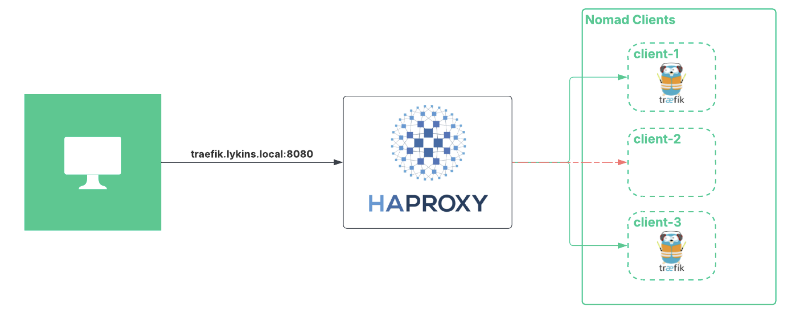
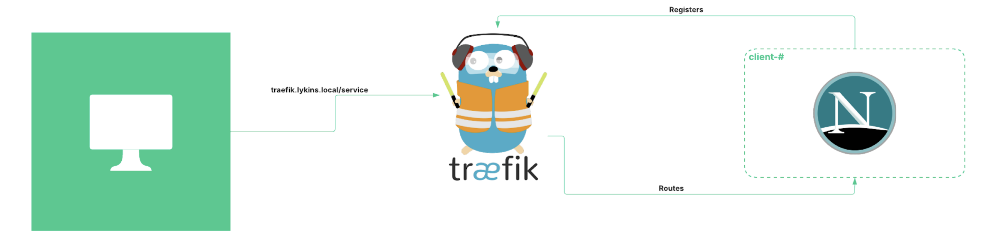

# homelab

So back when I started my HashiCorp Nomad journey, I bought a couple of minicompute devices from minisforum. 
I had used them to set up a baremetal, 3-node Nomad cluster on. 

Then the devices started collecting some dust and decided to finally build out a homelab with them. 

## Equipment

3 : Minisforum Venus Series UN100D

As far as I can tell, these are no longer sold. 

1 : Simple 12 Port Switch

And that is it. 

I did add additional storage to each node, configure Ceph + CephFS, which will be used later on with my lab. 

## Hypervisor

Proxmox 8.x

Three node cluster was set up. 

Did create a bonded networking, the Minisforum compute I bought came with 2-1GB nics.
I will probably buy another switch and split each nic on each device to a separate switch. Redundency on a budget.

## OS and Templates

Debian 12 has been my go to for the last year or so. Lightweight, simple and supported. I find that it has been pretty plug and play with Nomad. 

## Networking

I run a pi-hole for home use. It is also a lazy and simple way to host DNS. I think it is dnsmasq under the shell, but I don't have many IPs or host I need to track. 

For the Nomad lab, I will set up HAProxy in front to load balance Traefik, example below: 

## Nomad Load Balancing

For services running on Nomad, the Traefik - Nomad integration will be used to register services and route traffic to them. This integration is a very simple approach, even for those who are network illiterate like myself. 

## HashiStack

### Packer

Starts here. My HashiStack will rely on custom templates. 

### Terraform

Will provision the templates I built from Packer. Nothing too special. Leveraging the HCP Terraform agent. 

### Vault

Centralized secrets management. Packer, Terraform, and Nomad will be able to retrieve secrets. 

### Nomad

Will be the workhorse that runs all of my workloads. Will utilize Nomad's Native Service Discovery with Traefik. 

### Consul

Still a work in progress. I have not worked with Consul much, but a lab would give me that opportunity. 

